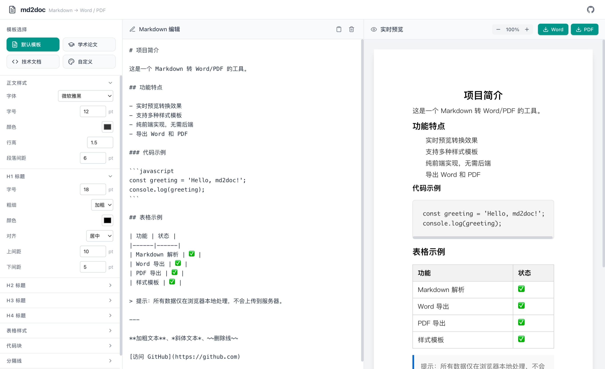

# md2doc

[中文](#中文) | [English](#english)



---

## 中文

纯前端的 Markdown 转 Word/PDF 工具，支持多种可切换、可编辑的样式模板，所见即所得。

**纯前端，无后端，数据本地，安全**：所有处理均在浏览器内完成，文档内容与样式配置仅保存在本地，不上传任何服务器，隐私有保障。

### 功能特性

- **Markdown 编辑与实时预览**：支持常见语法（标题、列表、表格、代码块、引用、链接、图片等），代码块语法高亮
- **导出 Word / PDF**：一键导出为 `.docx` 或 `.pdf` 格式
- **样式模板系统**：内置默认、学术论文、技术文档三种预设模板，支持切换和实时预览
- **自定义模板**：可修改样式配置（字体、字号、颜色、行高、标题样式、表格样式等），自定义模板自动保存到本地
- **所见即所得**：预览区以纸张形式展示，带缩放控制
- **Mermaid 图表**：支持流程图、时序图、甘特图等多种图表渲染
- **LaTeX 数学公式**：支持行内公式与块级公式渲染
- **多语言支持**：支持中文 / 英文界面切换

### 样式自定义详解

选择「自定义」模板后，可在右侧样式面板中精细调整以下配置，所有修改实时生效并自动保存到本地。

| 分类 | 可配置项 | 说明 |
|------|----------|------|
| **正文样式** | 字体 | 微软雅黑、Times New Roman、Arial、系统无衬线、宋体 |
| | 字号 | 8–24pt |
| | 颜色 | 正文文字颜色 |
| | 行高 | 1.0–3.0 倍 |
| | 段落间距 | 0–36pt |
| **H1–H4 标题** | 字号 | 10–36pt，各级标题独立设置 |
| | 粗细 | 加粗 / 正常 |
| | 颜色 | 各级标题独立颜色 |
| | 对齐 | 左对齐 / 居中 / 右对齐 |
| | 上/下间距 | 0–36pt |
| **表格样式** | 边框颜色 | 表格边框颜色 |
| | 边框模式 | 全部边框 / 仅横线 |
| | 表头背景 | 表头单元格背景色 |
| | 表头加粗 | 是 / 否 |
| | 表头颜色 | 表头文字颜色 |
| **代码块** | 字体 | Consolas、Monaco、Fira Code |
| | 字号 | 8–18pt |
| | 背景色 | 代码块背景 |
| | 边框 | 有边框 / 无边框 |
| **分隔线** | 类型 | 实线 / 虚线 / 点线 |
| | 颜色 | 分隔线颜色 |
| | 粗细 | 1–5px |
| **页面** | 页边距 | 10–40mm |
| | 主题色 | 用于引用块、链接等强调元素 |

### 技术栈

- React 19 + TypeScript
- Vite 6
- Tailwind CSS 4
- markdown-it + highlight.js（Markdown 解析与代码高亮）
- Mermaid（图表渲染）
- KaTeX（数学公式渲染）
- docx（Word 导出）
- html2pdf.js（PDF 导出）

### 快速开始

#### 安装依赖

```bash
npm install
```

#### 开发模式

```bash
npm run dev
```

#### 构建

```bash
npm run build
```

#### 预览构建结果

```bash
npm run preview
```

### 项目结构

```
md2doc/
├── src/
│   ├── components/     # 编辑器、预览、样式面板等组件
│   ├── i18n/           # 国际化（中文 / 英文）
│   ├── store/          # Zustand 状态管理
│   ├── templates/      # 预设与自定义模板
│   └── utils/          # Markdown 解析、导出、样式工具
├── docs/               # 需求文档、技术分析
└── index.html
```

---

## English

A pure frontend Markdown to Word/PDF conversion tool with multiple switchable and editable style templates — what you see is what you get.

**Pure frontend, no backend, local data, secure**: All processing is done within the browser. Document content and style configurations are saved locally only — nothing is uploaded to any server, ensuring your privacy.

### Features

- **Markdown Editing & Live Preview**: Supports common syntax (headings, lists, tables, code blocks, blockquotes, links, images, etc.) with syntax highlighting for code blocks
- **Export to Word / PDF**: One-click export to `.docx` or `.pdf` format
- **Style Template System**: Three built-in presets (Default, Academic, Technical), switchable with live preview
- **Custom Templates**: Modify style settings (font, size, color, line height, heading styles, table styles, etc.), custom templates are auto-saved locally
- **WYSIWYG**: Preview area displays in paper format with zoom control
- **Mermaid Diagrams**: Supports flowcharts, sequence diagrams, Gantt charts, and more
- **LaTeX Math**: Supports inline and block math formula rendering
- **Multi-language Support**: Chinese / English interface switching

### Style Customization

After selecting the "Custom" template, you can fine-tune the following settings in the right-side style panel. All changes take effect immediately and are auto-saved locally.

| Category | Option | Description |
|----------|--------|-------------|
| **Body Style** | Font | Microsoft YaHei, Times New Roman, Arial, System Sans-Serif, SimSun |
| | Font Size | 8–24pt |
| | Color | Body text color |
| | Line Height | 1.0–3.0x |
| | Paragraph Spacing | 0–36pt |
| **H1–H4 Headings** | Font Size | 10–36pt, independently set for each level |
| | Weight | Bold / Normal |
| | Color | Independent color for each level |
| | Alignment | Left / Center / Right |
| | Top/Bottom Margin | 0–36pt |
| **Table Style** | Border Color | Table border color |
| | Border Mode | All borders / Horizontal only |
| | Header Background | Header cell background color |
| | Header Bold | Yes / No |
| | Header Color | Header text color |
| **Code Block** | Font | Consolas, Monaco, Fira Code |
| | Font Size | 8–18pt |
| | Background | Code block background color |
| | Border | With border / No border |
| **Separator** | Type | Solid / Dashed / Dotted |
| | Color | Separator color |
| | Thickness | 1–5px |
| **Page** | Page Margin | 10–40mm |
| | Theme Color | Used for blockquotes, links, and other accent elements |

### Tech Stack

- React 19 + TypeScript
- Vite 6
- Tailwind CSS 4
- markdown-it + highlight.js (Markdown parsing & code highlighting)
- Mermaid (diagram rendering)
- KaTeX (math formula rendering)
- docx (Word export)
- html2pdf.js (PDF export)

### Getting Started

#### Install Dependencies

```bash
npm install
```

#### Development

```bash
npm run dev
```

#### Build

```bash
npm run build
```

#### Preview Build

```bash
npm run preview
```

### Project Structure

```
md2doc/
├── src/
│   ├── components/     # Editor, preview, style panel components
│   ├── i18n/           # Internationalization (Chinese / English)
│   ├── store/          # Zustand state management
│   ├── templates/      # Preset & custom templates
│   └── utils/          # Markdown parsing, export, style utilities
├── docs/               # Requirement docs, technical analysis
└── index.html
```

## License

Apache-2.0
